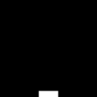

# Catch

A custom gym environment designed to quickly evaluate Reinforcement learning algorithms. The environment supports arbitrary number of last k frames to be used for learning algorithms.

<div align="center">
    
</div>

# Installation
```
git clone https://github.com/mynkpl1998/gym-catch.git
cd gym-catch 
pip install -e .
```

# How to use ?
```python
import gym
import gym_catch

# Just return the most recent frame only by setting kFrames to one.
env = gym.make("catch-v0", render=True, fps=30, kFrames=1)

# Reset the environment
state = env.reset()

# Step through the environment
while True:
    action = env.action_space.sample()
    state, reward, done, info = env.step(action)
    if done:
        break
```

# Environment Properties
* Observation space - Box(80, 80, 1)
* Action space - Discrete(3) - (Left, Right, Stay)

